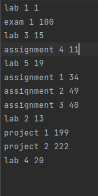
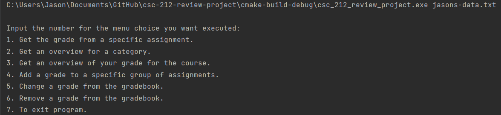
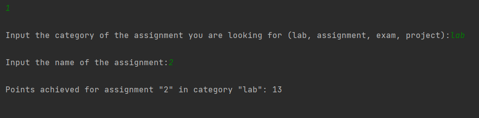
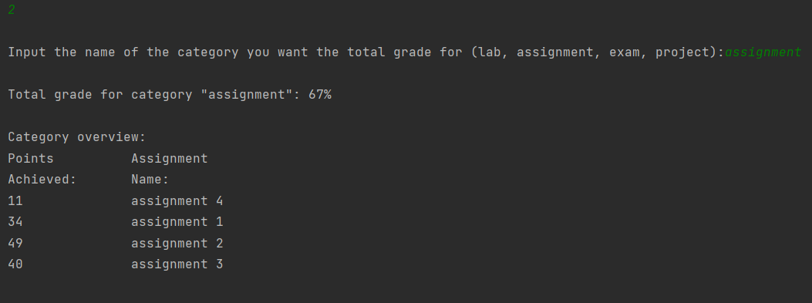
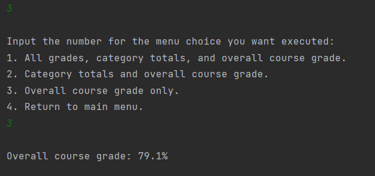
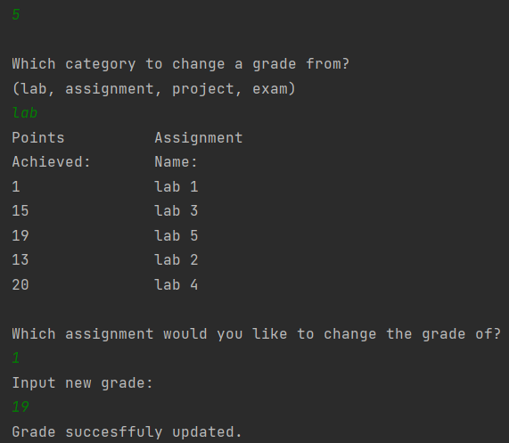
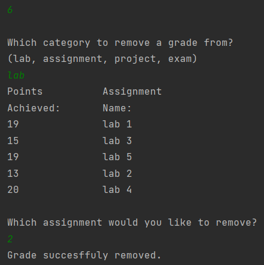
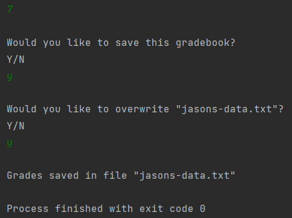
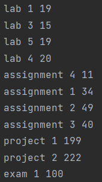

# csc-212-review-project

---

### Summary:

This program is designed to store the assignments and grades
for the CSC212 course that the user inputs via a text file, and 
allow the user to see their individual grades from assignments,
the total grade of a certain category of assignments, see
their total course grade, and even write to their text file and
add another assignment and grade.

Upon running the program using a text file as a command line
argument, the program prompts the user with a list of choices.
Depending on the number the user inputs, the program will perform
the listed functions and sometimes further prompt the user depending
on the option chosen. 

---

### Planning:

Below is the pseudocode our group created to plan our program prior
to beginning our coding.

#### Main:

#open input file to take in data
#create while loop to iterate through until the user is done
#creat a menu so the user can choose an option(menu is a series
of printed statements that prompt the user, this is maintained with the aforementioned while loop)

- Getting individual assignment grade - Prompts user for category that assignment
is held in, then name of assignment
- Getting category grade - Prompts user for name of category
- Getting total grade - Just returns the total grade of course
- Adding an assignment - Prompts user for category, assignment name,
and grade for a new assignment to be written to their file
- Ending program - Stops the while loop that prompts the user and closes file

#each option corresponds to functions in the gradebook.cpp file

#### Gradebook:

#Create a vector of pairs for each category
#Constructor - Creates default gradebook object with categories
of CSC212 course and takes in the file name as an argument
- Create a loop to read data from the file and assign the data to the correct
vector within gradebook.cpp

#public double Get_Lab_Grade, Get_Assignments_Grade, etc.
- various helper functions that return the different category totals, 
used in the getCategory function

#public double getAssignmentGrade(string category, string assignment_name)

 - Takes in string of category and assignment names, returns grade of the assignment

#public double getCategory(string category) 

- Takes in name of category, returns the total for the given category

#public double getTotalGrade()

- Calculates and returns course total, taking in consideration
of the different weight of each category

#public void addGrade(string category, string name, int grade)

- Writes to the text file with the information provided as arguments
in the same format that the text file is formatted.

#public void close()

- Closes the file

---

### Compilation Instructions:

At compilation time, the user must provide their text file name
as a command line argument for the program, assuming the
text file is in the current working directory for the program.

The text file must be formatted as each line containing the category name, assignment
name, and then the grade of the assignment (amount of points towards your final grade, 
ex: labs are out of 20 points) in that order all
separated by a single space. The order of the assignments does not
matter so long as they follow this format.

Example: "category assignment grade"

---

### Runtime Instructions:

At runtime, the program will automatically read the file and
store its data. It will then print out a set of instructions
that informs the user of what to input, and what each option presented
does. If an option requires additional input from the user, it will
specify. After a certain function has been carried out, the program
will print out the menu again, and allow the user to perform additional
functions. Once the user is done, choosing thr final option will close the
program and whatever data the user added to the text file will be saved.

---

### Sample Input/Output Screenshots:

Text file format example, note that the organization of different types of
assignments does not matter, so long as the same format is followed.

The menu display after compiling with the above data set.

Returning the grade of an assignment

Returning the overview of a specified category

Returning overall course grade (note that instead choosing options 1 or 2
return the overview of all categories and just the category totals respectively
in addition to course total)

Updating an existing grade

Removing an assignment from the file

Exiting the program

Input file after the changes from options 5 and 6

